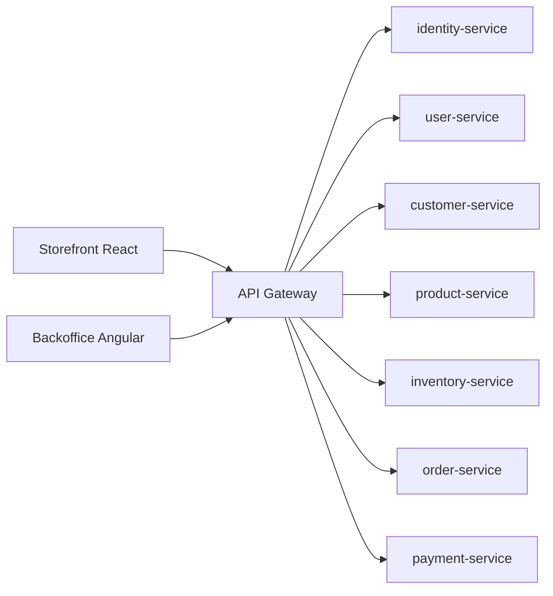

# Commerce Reference System

Commerce Reference System is a full-stack commerce reference repository. It combines a React storefront, an Angular backoffice, and .NET microservices for identity, users, customers, products, inventory, orders, and payments.

The repository is meant to help engineers, reviewers, and architects understand the target system shape, service boundaries, delivery approach, and local development flow without digging through the whole codebase first.

## Purpose

This system is a reviewable reference for designing and operating a complete commerce platform across customer, staff, and service boundaries. It demonstrates how storefront and backoffice experiences coordinate with independently owned services, and gives teams a concrete baseline for architecture reviews, delivery planning, security, and operational readiness. It is not positioned as a turnkey production product.

## Repository Layout

- `src/front-end/storefront`: customer-facing React application
- `src/front-end/backoffice`: internal Angular application
- `src/back-end`: .NET backend solution and shared backend platform code
- `src/docker-compose.yaml`: local multi-service compose file
- `docs`: project documentation, requirements, run guides, and reference notes
- `.github/workflows`: service-specific CI workflows

## System Scope

- Storefront for product browsing, login, and order history
- Backoffice for user, product, and order operations
- Backend services for identity, user, customer, product, inventory, order, and payment concerns

## Architecture Snapshot

## Service Map

- `identity-service`: authentication, token issuance, and identity integration
- `user-service`: internal users, roles, and user administration
- `customer-service`: customer profile data used by ordering flows
- `product-service`: product catalog and pricing
- `inventory-service`: stock, reservation, and availability logic
- `order-service`: order lifecycle and order orchestration
- `payment-service`: payment workflow extension point

## Quick Start

- Read [`docs/requirements/requirements.md`](docs/requirements/requirements.md) for the simplified product and system requirements.
- Read [`docs/run-local.md`](docs/run-local.md) for local run instructions.
- Read [`docs/service-map.md`](docs/service-map.md) for service ownership and cross-service flows.
- Read [`docs/tech-stack.md`](docs/tech-stack.md) for stack choices and rationale.
- Read [`docs/operations-baseline.md`](docs/operations-baseline.md) for the expected logging, metrics, and incident-handling baseline.
- Read [`docs/security/configuration-baseline.md`](docs/security/configuration-baseline.md) for secret handling and local configuration expectations.

## Documentation Index

- [`docs/README.md`](docs/README.md)

## Notes

- The original AsciiDoc requirement files remain under `docs/requirements/*.adoc` as source material.
- The Markdown requirement files are the easier-to-discuss version for product, architecture, and delivery conversations.
- Checked-in configuration now uses placeholders for credentials and signing keys. Real values should be injected through local environment variables or local-only overrides.

## Usage Policy

- This repository is shared for learning, technical review, and knowledge sharing.
- No permission is granted to copy, reuse, modify, redistribute, sublicense, sell, deploy, or use this code in another repository, product, service, or internal system without prior written approval from the repository owner.
- See [LICENSE](LICENSE), [DISCLAIMER.md](DISCLAIMER.md), [CONTRIBUTING.md](CONTRIBUTING.md), and [CODE_OF_CONDUCT.md](CODE_OF_CONDUCT.md).
