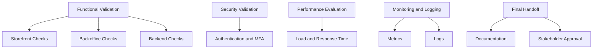

# Acceptance Criteria

This document is the simplified Markdown version of the result and validation expectations.

## Functional Validation

### Storefront

- product data displays correctly
- login works
- order placement works
- order history works

### Backoffice

- user CRUD works
- product CRUD works
- order status updates work
- verified orders cannot be changed

### Backend

- API endpoints behave correctly
- authentication works
- data stays consistent across service boundaries

## Performance Targets

- support up to 1000 concurrent users in load testing scenarios
- average response time below 200ms under normal load
- 95th percentile response time below 500ms under high load

## Security Validation

- token validation is correct
- MFA flows work as expected
- vulnerabilities are reviewed before release

## Operational Validation

- metrics are visible in monitoring tools
- critical events are logged
- handoff documents are complete

## Validation Map

