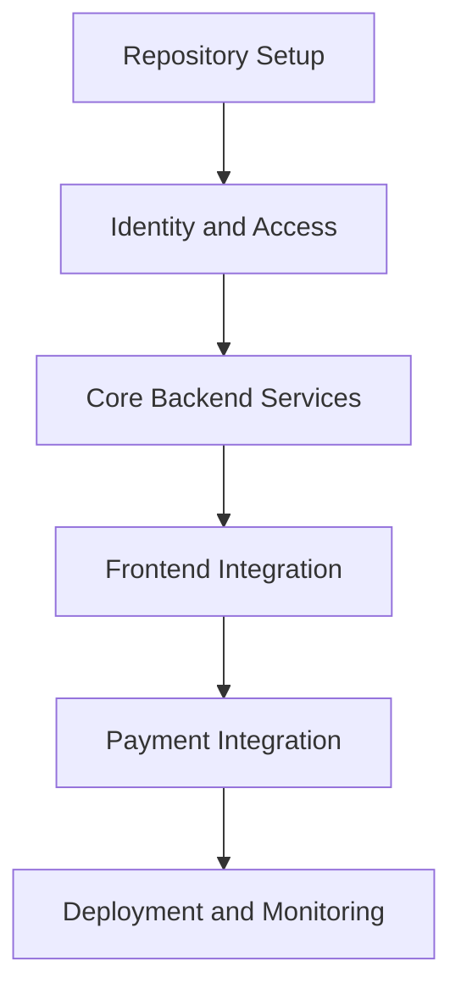

# Implementation Plan

This document is the simplified Markdown version of the implementation plan.

## Frontend

### Storefront

- set up the React application
- implement login, product listing, and order history
- integrate with identity, product, and order APIs

### Backoffice

- set up the Angular application
- implement user, product, and order management areas
- integrate with user, product, and order APIs

## Backend

- identity-service: authentication, SSO, MFA, and token handling
- user-service: user and role management
- product-service: catalog CRUD and image handling
- order-service: order lifecycle and validation
- inventory-service: stock logic and availability calculations
- payment-service: payment processing and status handling

## Platform

- API Gateway for routing and cross-cutting concerns
- Docker for containerized local and deployment flows
- CI/CD workflows for service-based delivery
- observability stack for metrics and logs

## Delivery Order

