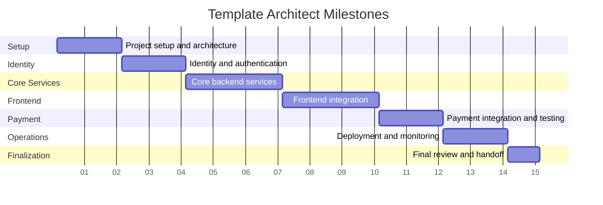

# Milestones

This document is the simplified Markdown version of the milestone plan.

## Milestone List

1. project setup and architecture
2. identity and authentication
3. core backend services
4. frontend integration
5. payment integration and testing
6. deployment and monitoring
7. final review and handoff

## Timeline Overview

- total duration: about 15 weeks

