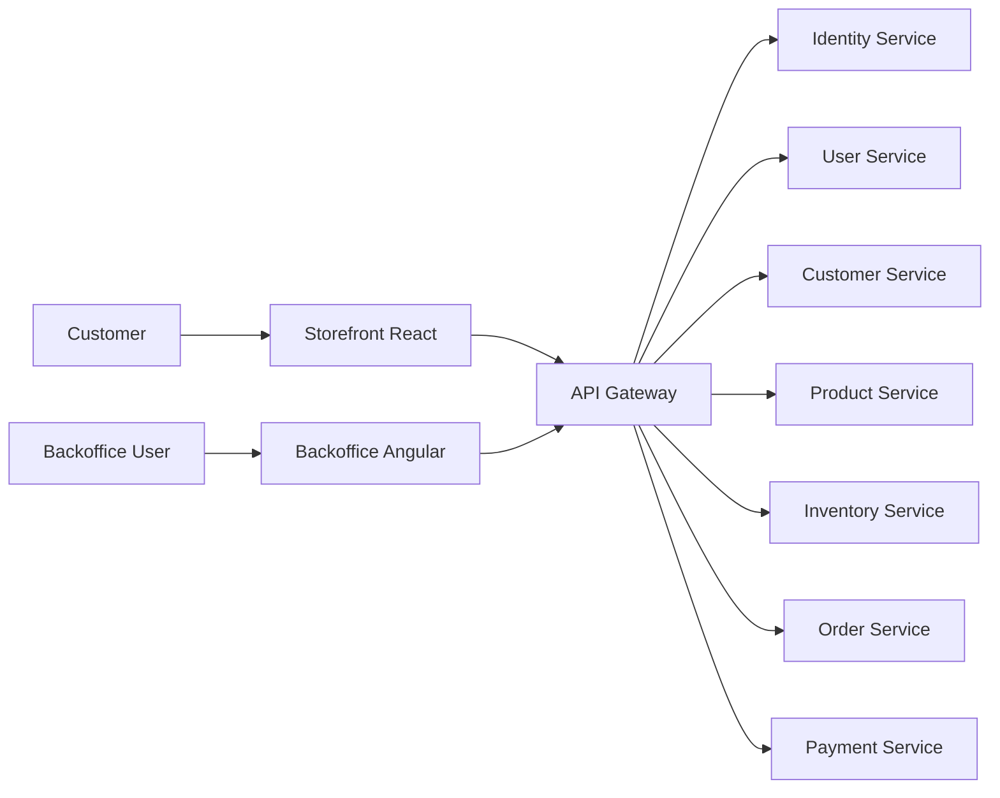
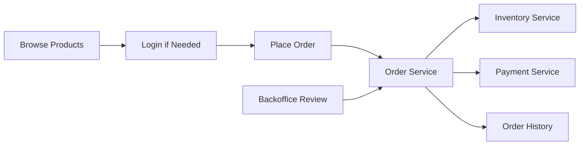

# Requirements

This document is the Markdown version of the product and system requirements for easier discussion with product owners, architects, and engineers.

## System Summary

- storefront: React application for customers
- backoffice: Angular application for internal operations
- backend: .NET microservices behind an API Gateway
- identity: token-based authentication, Microsoft SSO, and MFA

## Context Diagram

## Must-Have

### Storefront

- display product image, price, and in-stock status
- require login before order placement
- redirect unauthenticated users to login
- show order history for logged-in users

### Backoffice

- CRUD for users
- CRUD for products
- view orders created by storefront users
- allow order cancellation
- allow order verification
- keep verified orders immutable

### Backend

- use the latest .NET version
- route all requests through an API Gateway
- use token-based authentication and role-based authorization

### Identity Service

- provide authentication and authorization
- support Microsoft SSO
- support MFA
- remain a standalone service

### User Service

- manage guest, member, backoffice user, and super-admin roles
- seed a default `manager / manager` super-admin on first use
- prevent super-admin deletion

### Product Service

- manage image, price, and unit of measurement

### Order Service

- store customer info and product info per order
- require exactly one customer per order
- require one or more order lines
- store product details and quantity per order line

### Inventory Service

- track `InstockQty`
- track `OrderedQty`
- track `CommitQty`
- calculate `AvailableQty = InstockQty - OrderedQty - CommitQty`

## Should-Have

- remember user login across sessions
- support pagination and filtering in backoffice screens

## Could-Have

- storefront user profile management
- backoffice analytics dashboard

## Core Business Flow

